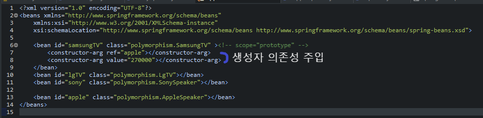

# springbook

## 목차

- # 목차
	- [용어](#용어)
	- [수행 순서](#수행-순서)
	- [결합도](#결합도)
	- [빈](#빈)
	- [의존 주입](#의존-주입)
	- [참고 자료](#참고-자료)

## 용어

 1. IOC(제어의 역전) Inversion of Control
 2. DI(의존주입) Dependecy injection
     * 생성자 인젝션
     * setter 인젝션
     * 멤버변수 인젝션 
 3. AOP(공통관심사 OR 횡단관심사) Aspect Oriented Programming
 4. BEAN(강낭콩) 스프링에서 객체를 빈이라 부름

## 수행 순서
1. encoding 설정
  * window > prefer... > encoding 검색 > utf-8로 변경
  * xml 수정   
  	``` 
	<!-- 캐릭터 인코딩 필터 설정  -->
	<!-- 컨트롤러에서 response.setCharacterEncoding()를매번 실행하지 않기 위해 서블릿 필터를 이용해 처리  -->
	<filter>

		<filter-name>encodingFilter</filter-name>

		<filter-class>org.springframework.web.filter.CharacterEncodingFilter</filter-class>

		<init-param>

			<param-name>encoding</param-name>

			<param-value>UTF-8</param-value>

		</init-param>

		<init-param>

			<param-name>forceEncoding</param-name>

			<param-value>true</param-value>

		</init-param>
	</filter>
	<filter-mapping>

		<filter-name>encodingFilter</filter-name>

		<url-pattern>/*</url-pattern>
	</filter-mapping>
	 <!-- jsp 파일 utf-8 페이지 인코딩 설정 <%@ page pageEncoding="UTF-8" %>  -->
	<jsp-config>

		<jsp-property-group>

			<url-pattern>*.jsp</url-pattern>

			<page-encoding>UTF-8</page-encoding>

		</jsp-property-group>
	</jsp-config>

  	```
2. 톰캣 서버 연동
3. pom.xml 버전 체크
	* 자바버전 1.8
	* 스프링프레임워크 5.0.7
	* junit 4.12
	* maven 플러그인 1.8
  
 4. maven 디펜던시 추가 안될때 Window - Preferences - Maven > 다운로드 관련 다 체크
 5. [db테스트를 위한 sql 생성](./src/main/resources/springbook.sql) 
  
 
 ## 결합도
 
 * [TVUser.java](./src/main/java/polymorphism/TVUser.java)
 

 ## 빈

1. 리소스 영역에 [application.xml](./src/main/resources/applicationContext.xml) 생성후 빈 추가

2. [TVUser](./src/main/java/polymorphism/TVUser.java) 파일에서 빈 팩토리 호출해서 사용 기본적으로 싱글톤 패턴으로 사용됨

* 번외: 싱글톤패턴 사용하기 싫을때 [application.xml](./src/main/resources/applicationContext.xml)
   `scope="prototype"` 스코프 속성을 사용해 바꿀수 있음


## 의존 주입

1. xml 방식
	
	
	* 새터
	사진찍어야됨
2. 어노테이션 방식

	* AutoWired
	* Qualifier


### 참고 자료

* [의존성 주입 관련](https://codevang.tistory.com/312)
* [의존관계 쉽게 이해하기](https://tecoble.techcourse.co.kr/post/2021-04-27-dependency-injection/)
* https://cbw1030.tistory.com/m/309
